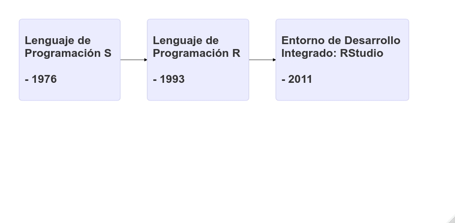

```{r setup, include = FALSE}
knitr::opts_chunk$set(echo = TRUE)
knitr::opts_chunk$set(error = F)
knitr::opts_chunk$set(message = F)
```


class: inverse, middle, center
# Hola, hoy nos adentraremos en el mundillo de R

---


## Empecemos...¿Qué rayos es R?
```{r, echo = F, eval = F}
library(DiagrammeR)

pdf("diagrama.pdf")

diagrama <- mermaid("graph LR
        A(<h2> Lenguaje de <br> Programación S <br> <br> -  1976 <h/2>)-->B(<h2> Lenguaje de <br> Programación R <br> <br> -  1993 </h2>)
        B-->C(<h2> Entorno de Desarrollo <br> Integrado: RStudio  <br> <br> -  2011 </h2>)
        ")

dev.off()

```


- R es considerado como un dialecto del lenguaje S 

- R fue creado por Ross Ihaka & Robert Gentleman

- Lenguaje de Programación Orientada a Objetos (POO)

- Si el objeto ya existe, su valor es borrado y reemplazado

- Operador asignación ( <- ) 

- Uso relativamente intuitivo

---

## Comunidad Comprometida

[](https://stackoverflow.com/) [](https://stats.stackexchange.com/)
[](https://www.facebook.com/groups/ecologyinr)

---

## Paquetes 
```{r}
# 20 de marzo a las 01:29 A.M.
nrow(available.packages())
```

```{r, echo = F, fig.width = 7, fig.height = 4.7, fig.align = 'center'}
library(png)
library(grid)
img  <- readPNG("images/crecimiento_paquetes.png")
grid.raster(img)
```

[Todos los Paquetes de R](https://www.rdocumentation.org/)

---

## El paquete que te soluciona la vida: **Tidyverse**
[Libro: R for Data Science (**Wickham** & Grolemund, 2017)](https://r4ds.had.co.nz/)

<p> </p>
<center>

</center>

---
 
## ¿Por qué debo usar R, y no SPSS, Infostat, Past, STATA...?

- Potencial en visualización de datos (gráficos de alto impacto)

- Potencial en uso estadístico  (Frecuentista & Bayesiano)

- R resume los resultados en una línea

- R es compatible con todo (código libre y abierto)

- Comunidad comprometida

- Conexión con otros software (\Latex, Python, Julia, QGIS, MaxEnt)

- R hace de todo


---

class: center, middle, inverse
# Objetivo: Recordar conceptos estadísticos e introducción al análisis de datos en R

---

# Teoría y creación de objetos de R

R trabaja con objetos (POO), y **todos** tienen...
- **Nombre**: debe comenzar con una letra (A- Z o a-z), puede incluir letras, dígitos (0-9), y puntos (.). R discrimina entre mayúsculas y minúsculas (X y x).

```{r}
abundancia <- c(12, 12, 11, 10, 8, 23)
playas <- c("San Bartolo", "Pucusana", "Chancaíllo", "Santa Rosa", "Costa Azul", "Lurín")
```

--

- **Contenido**: Numérico o Caracteres

```{r}
abundancia
playas
```

---
- **Dimensión** o **longitud**

```{r}
length(abundancia)
length(playas)
```

```{r}
base_datos <- data.frame(
                        Alumnos = c("Yessica", "Juan", "Uriel"),
                        Nota = c(20, 17, 11)
                        )
base_datos
dim(base_datos)
```


---

# Estructura de datos (**clases**) en R

---

## Vector

```{r}
Playas <- c("San Bartolo", "Pucusana", "Chancaíllo", "Santa Rosa", "Costa Azul", "Lurín")
class(Playas)

Nivel_contaminacion <- c("Saludable", "No Saludable", "Poco Saludable", "Saludable", "No Saludable", "No Saludable")
class(Nivel_contaminacion)

Presencia_garza <- c(T, F, T, T, F, T)
class(Presencia_garza)

Abundancia_garza <- c(12, 23, 10, 5, 10, 12)
class(Abundancia_garza)
```

---

## Data Frame
```{r}
data <- data.frame(Playas, Nivel_contaminacion, Presencia_garza, Abundancia_garza)

data

dim(data)

class(data)

```

---
### Indexación
```{r}
data[1, 2]

data[3, 1]

data[3, c(1,2,3,4)]

data[3, 1:4]

```

---
### Indexación con DataEditR
```{r}
library(DataEditR)
# DataEditR::data_edit(data)
```


---

## Listas
```{r}
lista_a <- list(Playas, Nivel_contaminacion, data)
lista_a[[1]]
lista_a[[2]]
lista_a[[3]]
```

---

```{r}
lista_b <- list("Hola", Playas, "Colores") 
lista_b
```

---

# Bases de datos
## Tidy data [(Wickham, 2014)](https://vita.had.co.nz/papers/tidy-data.pdf)

 - Estructura adecuada de la base de datos
 
 - Variable -> columna
 
 - Observación -> fila 


---
```{r, echo = F}
library(tidyverse)
library(kableExtra)
```

# ¿Será tidy?
```{r}
df1 <- data.frame(
                 nombres = c("Hormiga A", "Hormiga B", "Hormiga C", "Hormiga D"),
                 Pantanos_Villa = c(12, 22, 9, 10), 
                 Ventanilla = c(0, 7, 6, 1)
                 )
```

```{r, echo = F}
kable(df1) %>% kable_paper("striped") %>% kableExtra::kable_styling(font_size = 13)
```

---
# ¿Será tidy?
```{r}
df2 <- data.frame(
                  localidad = c("Pantanos de Villa, Ventanilla", "Pantanos de Villa, Ventanilla" ),
                  Hormiga_A = c(12, 0), 
                  Hormiga_B = c(22, 7), 
                  Hormiga_C = c(9, 6), 
                  Hormiga_D = c(10, 1)
                 )
```


```{r, echo = F}
kable(df2) %>% kable_paper("striped") %>% kable_styling(font_size = 13)
```

---
# ¿Será tidy? 
```{r, echo = F}
library(kableExtra)
```

```{r}
df3 <-  data.frame(
                  especie = c("Hormiga A", "Hormiga B", "Hormiga C", "Hormiga D", "Hormiga A", "Hormiga B", "Hormiga C", "Hormiga D"), 
                  localidad = c("Pantanos de Villa", 'Pantanos de Villa', "Pantanos de Villa", "Pantanos de Villa", "Ventanilla", 'Ventanilla', "Ventanilla", "Ventanilla"), 
                  abundancia = c(12, 22, 9, 10, 0, 7, 6, 1)
                  )
```

```{r, echo  = F}
kable(df3) %>% kable_paper("striped") %>% kable_styling(font_size = 13)
```

---

class: inverse, middle, center
# Importar base de datos

---

## Importar en formato **CSV** (comma-separated values)
```{r, echo = T}
df <- read.csv("/home/biologisturiel/Descargas/talleres_en_R/github_talleres/data/data_emerita.csv")
```

```{r, echo = T}
head(df)
```

---

```{r, echo = T}
head(df, 10)
```

---

```{r, echo = T}
tail(df)
```

---

```{r, echo = T}
tail(df, 9)
```

---

## Otros casos
## Excel
```{r, eval = F}
df_excel <- read_excel('aca debe ir la dirección en donde se encuentra tu archivo, tu archivo debe acabar en xls o xlsx')
```

## Importar archivos de más de 3GB (muy pesados)
```{r}
library(data.table)
df_pesada <- fread("/home/biologisturiel/Descargas/talleres_en_R/github_talleres/data/data_emerita.csv")
```

---

### ¿fread o read.csv?
```{r}
system.time(fread("/home/biologisturiel/Descargas/talleres_en_R/github_talleres/data/data_emerita.csv"))
```

```{r}
system.time(read.csv("/home/biologisturiel/Descargas/talleres_en_R/github_talleres/data/data_emerita.csv"))
```

---

## Importar archivos delimitados por espacios (por ejem GBIF)
```{r}
df_gbif <- fread("/home/biologisturiel/Descargas/talleres_en_R/github_talleres/data/occurrence.txt")
```

## Importar ignorando ubicación del archivo
```{r, eval = F}
df_aelegir <- fread(file.choose()) 
```

---
# Distribución y teoría de la probabilidad
- Los datos de ecología casi nunca  se adecúan a una distribución normal

- Los datos de ecología se pueden transformar pero la conclusión sería en función de los datos transformados

- Datos en ecología: Usan distribución de Poisson (recuentos) o Binomial (presencia o ausencia)

---
## Distribución normal 
```{r, echo = F}
library(ggthemes)
library(png)

Z_value <- seq(-4, 4, length = 1000)
Probabilidad <- dnorm(Z_value)
data_normal <- data.frame(x = Z_value, y = Probabilidad)

ggplot(data = data_normal,
       aes(x = x,
           y = y)) +  
        geom_jitter() + 
        xlab("Z value") +
        ylab("Probabilidad") + 
        theme_bw()


```

---

## Distribución de Poisson (recuentos)
```{r, echo = F}
library(rphylopic)
library(ggthemes)
bug <- image_data("136edfe2-2731-4acd-9a05-907262dd1311", size="512")[[1]]

label_y <- expression(paste("Abundancia de", italic(" Bicho sp.")))

datos_poisson <- rpois(90, lambda = 0.6)
dens <- density(datos_poisson)

variable_y <- length(datos_poisson)*dens$y

probando <- data.frame(dens = dens$x, variable_y = variable_y)

data(iris)
ggplot(data = probando,
       aes(x = dens,
           y = variable_y)) +
        geom_jitter() + 
        add_phylopic(bug, alpha = 0.2, ysize = 20, x = 2.5, y = 50) +
        xlab("Valor") + 
        ylab(label_y) + 
        theme_bw()

```

---

## Distribución Binomial (presencia o ausencia)
```{r, echo = F}
mouse <- image_data("6b2b98f6-f879-445f-9ac2-2c2563157025", size="512")[[1]] 

x <- rbinom(1000, 1, prob = 0.2)
densidad_x <- density(x)

variable_y_binom <- length(x)*densidad_x$y

data_binom <- data.frame(x = densidad_x$x, y = variable_y_binom)
  
ggplot(data = data_binom, 
       aes(x = x,
           y = y)) +
         geom_jitter() + 
         theme_bw() + 
         add_phylopic(mouse, alpha = 0.2, ysize = 800, x = 1, y = 2500, ) + 
         xlab("Valor") + 
         ylab(expression(paste("Abundancia de roedor"))) 
         
```

---

## Distribución de una especie (SDM: Species Distribution Model)
```{r, echo = F}
library(RColorBrewer)

cols <- brewer.pal(3, "BuGn")
pal <- colorRampPalette(cols)

image(volcano, col = pal(20))
```

---
## Distribución de una especie (SDM: Species Distribution Model)
```{r, echo = F}
set.seed(1)
x <- rnorm(10000)
y <- rnorm(10000)
smoothScatter(x, y)
```

---

class: center, inverse, middle
# Estadísticos descriptivos 

---

## Estadísticos de tendencia central

--

### Media (promedio)
$$
\overline x=\frac{\sum x}{n}
$$

```{r}
mean(df$LCT)
```

### Mediana

$$
Mediana  = \frac{(n + 1)}{2}
$$
```{r}
median(df$LCT)
```

---

### Moda

- El valor de mayor frecuencia absoluta 

```{r, echo = T}
frecuencias <- table(df$LCT)
frecuencias_df <- as.data.frame(frecuencias)
which.max(frecuencias_df$Freq)

frecuencias_df[56, ]
```

---

## Estadísticos de dispersión

--

### Varianza (incluir unidad de medida)
$$
s^{2} = \sqrt \frac{\sum(x_{i} - \overline x)^{2}}{n}
$$
```{r}
var(df$LCT)
```

### **Desviación estándar (DE o SD) (incluir unidad de medida)**
$$
s = \sqrt \frac{\sum(x_{i} - \overline x)^{2}}{n}
$$
```{r}
sd(df$LCT)
```

---

### Coeficiente de variación (adimensional)
$$
CV = \frac{s}{\overline x}*100
$$
```{r}
sd(df$LCT)/mean(df$LCT)*100
```

### **Error estándar (EE or SE) (incluir unidad de medida)**
$$
SE = \frac{s}{\sqrt{n}}
$$
```{r}
sd(df$LCT)/sqrt(nrow(df))
```
### [**¿SD o SE?**](https://www.ncbi.nlm.nih.gov/pmc/articles/PMC1255808/#:~:text=The%20standard%20deviation%20(often%20SD%20is%20a%20measure%20of%20variability.&text=We%20can%20estimate%20how%20much,standard%20deviation%2C%20confusion%20is%20understandable)

---

## Tidyverse en obtención de estadísticos
### [Data de aplicación](https://www.researchgate.net/publication/330900496_IMPLICATIONS_OF_THE_SANITARY_QUALITY_OF_BEACHES_IN_THE_PARASITIC_ECOLOGY_OF_EMERITA_ANALOGA_STIMPSON_1857_DECAPODA_HIPPIDAE)

```{r}
glimpse(df)
```

---
### Playa de estudio
```{r}
unique(df$LC)
```

---
### Promedio de LCT por playa de estudio
```{r}
df %>% 
  group_by(LC) %>% 
  summarise(promedio_playas_LCT = mean(LCT))
```

---
### SD de LCT por playa de estudio
```{r}
df %>% 
  group_by(LC) %>% 
  summarise(SD_playas_LCT = sd(LCT))
```

---
### SE de LCT por playa de estudio
```{r}
df %>% 
  group_by(LC) %>% 
  summarise(SE_playas_LCT = sd(LCT)/sqrt(nrow(df)))
```

---
### Recordando la interpretación de un boxplot 
```{r, echo = F}
boxplot(df$LCT, col = "#99D8C9", border = "black", xlab = "Eje x", ylab = "Eje y")
```

---
### ¿En qué playa los muy muys tienen mayor LCT?

```{r, eval = F}
library(ggthemes)

# formato para realizar cualquier tipo de gráfico en ggplot2
ggplot(data = df, aes(x = LC, y = LCT)) + 
  
  # comando para ejecutar el boxplot 
  geom_boxplot() + 
  
  # tema del gráfico 
  theme_bw() + 
  
  # etiqueta para el eje x
  xlab("Playas") + 
  
  # etiqueta para el eje y
  ylab("Longitud del cefalotórax del muy muy") +
  
  # modificando la estructura del gráfico
  theme(axis.text.x = element_text(angle = 90))
```

---

### ¿En qué playa los muy muys tienen mayor LCT?
```{r, echo = F}
library(ggthemes)

# formato para realizar cualquier tipo de gráfico en ggplot2
ggplot(data = df, aes(x = LC, y = LCT)) + 
  
  # comando para ejecutar el boxplot 
  geom_boxplot() + 
  
  # tema del gráfico 
  theme_bw() + 
  
  # etiqueta para el eje x
  xlab("Playas") + 
  
  # etiqueta para el eje y
  ylab("Longitud del cefalotórax del muy muy") +
  
  # modificando la estructura del gráfico
  theme(axis.text.x = element_text(angle = 90))
```

---
### ¿Qué sexo tiene mayor LCT?
```{r, eval = F}
# formato por defecto (fill = llenar "rellena con color en fx de var. independiente)
ggplot(data = df, aes(x = SEX, y = LCT, fill = SEX)) + 
  
  # comando para ejecutar un violin plot (show.legend = F, remueve leyenda)
  geom_violin(show.legend = F) +
  
  # tema para publicación (base_size = asigna tamaño de fuente)
  theme_tufte(base_size = 17) + 
  
  # genera ejes, ya que theme_tufte no genera tufte (X & y)
  theme(axis.line = element_line()) +

  # arreglamos etiquetas
  xlab("Sexo") +
  ylab("Longitud del cefalotórax")
  
```

---

### ¿Qué sexo tiene mayor LCT?
```{r, echo = F}
# formato por defecto (fill = llenar "rellena con color en fx de var. independiente)
ggplot(data = df, aes(x = SEX, y = LCT, fill = SEX)) + 
  
  # comando para ejecutar un violin plot (show.legend = F, remueve leyenda)
  geom_violin(show.legend = F) +
  
  # tema para publicación (base_size = asigna tamaño de fuente)
  theme_tufte(base_size = 17) + 
  
  # genera ejes, ya que theme_tufte no genera tufte (X & y)
  theme(axis.line = element_line()) +

  # arreglamos etiquetas
  xlab("Sexo") +
  ylab("Longitud del cefalotórax")
  
```

---

### ¿Cuál es la relación entre el tamaño del muy muy y la carga parasitaria? 
```{r, eval = F}
 # formato convencional
ggplot(data = df, aes(x = P_altmani, y = LCT)) +
  
  # geom_point (alternativa = geom_jitter), alpha genera transparencia (0-1)
  # fill = relleno; color = bordes; shape = forma; size = tamaño
  geom_point(alpha = 0.5, fill  = "blue", color = "yellow", shape = 21, size = 2.7) +
  
  # genera una línea de tendencia 
  geom_smooth() + 
  
  # tema elegido (bw: black and white)
  theme_bw() +
  
  # asignar nombres a etiquetas
  xlab("Profilicollis altmani") +
  ylab("Longitud del cefalotórax")
  
```

---
### ¿Cuál es la relación entre el tamaño del muy muy y la carga parasitaria? 
```{r, echo = F}
 # formato convencional
ggplot(data = df, aes(x = P_altmani, y = LCT)) +
  
  # geom_point (alternativa = geom_jitter), alpha genera transparencia (0-1)
  # fill = relleno; color = bordes; shape = forma; size = tamaño
  geom_point(alpha = 0.5, fill  = "blue", color = "yellow", shape = 21, size = 2.7) +
  
  # genera una línea de tendencia 
  geom_smooth() + 
  
  # tema elegido (bw: black and white)
  theme_bw(base_size = 13) +
  
  # asignar nombres a etiquetas
  xlab("Profilicollis altmani") +
  ylab("Longitud del cefalotórax")
  
```

---

class: middle, inverse, center
# Inferencia estadística

---

### Tener consideración los NAs (not available) y outliers (datos atípicos)
```{r}
library(DataExplorer)
plot_missing(df)
dim(df)
```

---
### Eliminar NAs
```{r}
dim(df)
df_sinNA <- drop_na(df)
dim(df_sinNA)
```

```{r, eval = F, fig.height = 3.5, fig.width = 4}
plot_missing(df_sinNA)
```

---
### Eliminar outliers **(solo cuando se elabora un modelo: LM, GLM; criterio)**
```{r}
# Criterio para establecer límites de valores atípicos 
# Rango intercuartílico: Q3 - Q1 
# Q3 + 1.5 * IQR 
# Q1 - 1.5 * IQR 

fivenum(df$NTP)
```

```{r, fig.height = 3.7, fig.width = 3.7}
boxplot(df$NTP)
```

### Eliminar outliers
```{r}
outliers <- boxplot(df$NTP, plot = F)$out
outliers
```

---
### Eliminar outliers
```{r}
df_sinoutliers <- df[-which(df$NTP %in% outliers), ]
```

```{r, fig.height = 3.9, fig.width = 3.9}
boxplot(df_sinoutliers$NTP)
```

---
## Pruebas paramétricas
Requisitos: 
- Normalidad de los datos (Prueba de Shapiro-Wilk & Kolmogorov-Smirnov) 
$$H_{0}: X \in Normal$$
$$H_{1}: X \notin Normal$$
- Homocedasticidad (Prueba de Levene)
$$H_{0}: s² = s²$$
$$H_{1}: s² \neq s² $$

--

### Prueba de t de Student: 

$$H_{0}: \overline x_{Playa 1} = \overline x_{Playa 2}$$
$$H_{1}: \overline x_{Playa 1} \neq \overline x_{Playa 2}$$
---

### Prueba de t de Student (muestras relacionadas): 

$$H_{0}: \overline x_{Playa 1} = \overline x_{Playa 2}$$

$$H_{1}: \overline x_{Playa 1} \neq \overline x_{Playa 2}$$

### Prueba de ANOVA: 

$$H_{0}: \overline x_{Playa 1} = \overline x_{Playa 2} = \overline x_{Playa 3}...$$

$$H_{1}: \overline x_{Playa 1} \neq \overline x_{Playa 2} = \overline x_{Playa 4}...$$

### Correlación de Pearson: 
$$H_{0}: p~value = 0$$
$$H_{1}: p~value \neq 0$$
---

## Pruebas no paramétricas

Requisitos:
- No normalidad 

### Prueba de U de Mann-Whitney:
$$H_{0}: \overline x_{Playa 1} = \overline x_{Playa 2}$$
$$H_{1}: \overline x_{Playa 1} = \overline x_{Playa 2}$$

```{r}
wilcox.test(df$LCT ~ df$SEX, paired = F, alternative = "two.sided")
```
---

```{r, fig.height = 3.9, fig.width = 3.9}
library(ggpubr)
ggplot(data = df, aes(x = SEX, y = LCT, fill = SEX)) +
  geom_violin(show.legend = F) +
  stat_compare_means(method = "wilcox.test", label.x = 1.35, label.y = 5) +
  theme_tufte(base_size = 12) +
  theme(axis.line = element_line()) + 
  scale_fill_gdocs()
```

---

### Prueba de Wilcoxon no paramétrico:
$$H_{0}: \overline x_{Playa 1} = \overline x_{Playa 2}$$
$$H_{1}: \overline x_{Playa 1} = \overline x_{Playa 2}$$

---

### Prueba de Kruskal-Wallis:

$$H_{0}: \overline x_{Playa 1} = \overline x_{Playa 2} = \overline x_{Playa 3}...$$

$$H_{1}: \overline x_{Playa 1} \neq \overline x_{Playa 2} = \overline x_{Playa 4}...$$

```{r}
kruskal.test(df$NTP ~ df$LC)
```
---

### Prueba de Kruskal-Wallis:
```{r, fig.height = 4.7, fig.width = 6, warning = F}
ggplot(data = df, aes(x = LC, y = NTP)) + 
  geom_boxplot()  + 
  stat_compare_means(method = "kruskal.test", label.x = 1.4, label.y = 44) + 
  stat_compare_means(method = "wilcox.test", comparison = list(c("Conchán", "Costa Azul"), c("Pucusana", "San Pedro"), c("Los Delfines", "Los Viños"), c("Conchán", "El Silencio"))) +
  theme_bw() + 
  theme(axis.text.x = element_text(angle = 90)) 
  
```

---

### Correlación de Spearman: 

$$H_{0}: p~value = 0$$
$$H_{1}: p~value \neq 0$$

```{r, warning = F}
cor.test(df$NTP, df$LCT, method = "spearman")
```

---

### Seleccionamos variables de interés para la correlación
```{r}
df_select <- df_sinNA %>% select(DIST, LCT, NTP, RP, P_altmani, Proleptus_sp.)
head(df_select, 13)
```

---
### Hallamos coeficientes de Rho de Spearman
```{r}
library(corrplot)
coeficientes <-  cor(df_select, method = "spearman")
coeficientes

```

---

### Hallamos *p-value*

```{r}
pvalores <- cor.mtest(df_select, method = "spearman", exact = F)$p
pvalores
```

--- 
---

## Diagrama de correlación de Spearman

```{r, echo = T, fig.height = 5.1, fig.width = 5.1, fig.align = 'center'}
library(ggcorrplot)
ggcorrplot(coeficientes, p.mat = pvalores, type = "upper", hc.order = F, lab = T, insig = "blank") + 
  theme_bw() + 
  theme(axis.text.x = element_text(angle = 90)) +
  scale_fill_gradient2(name = "Correlación\nSpearman", low = "blue", high = "red", mid = "white", limit = c(-1, 1)) +
  xlab(NULL) + 
  ylab(NULL)
```

---

class: inverse, middle, center
# Fin

---
# Pero antes...
- example(): Un ejemplo de R sobre cualquier comando

- [**Swirl**](https://swirlstats.com/students.html): Paquete para aprender R <3

- help(): Pedir ayuda en R (muestra info relacionada al comando)

- Stackoverflow: Comunidad comprometida

- Cheatsheet: [Basic](https://www.rstudio.com/wp-content/uploads/2016/10/r-cheat-sheet-3.pdf); [Dplyr](https://www.rstudio.com/wp-content/uploads/2015/02/data-wrangling-cheatsheet.pdf); [ggplot2](https://www.rstudio.com/wp-content/uploads/2015/03/ggplot2-cheatsheet.pdf)

---

class: inverse, middle, center
# Ahora sí, fin :) 


