```{r setup, include = FALSE}
knitr::opts_chunk$set(echo = TRUE)
knitr::opts_chunk$set(error = F)
knitr::opts_chunk$set(message = F)
```

```{r xaringanExtra-clipboard, include = FALSE}
htmltools::tagList(
  xaringanExtra::use_clipboard(
    button_text = "<i class=\"fa fa-clipboard\"></i>",
    success_text = "<i class=\"fa fa-check\" style=\"color: #90BE6D\"></i>",
    error_text = "<i class=\"fa fa-times-circle\" style=\"color: #F94144\"></i>"
  ),
  rmarkdown::html_dependency_font_awesome()
)
```

```{r xaringan-scribble, include = FALSE}
xaringanExtra::use_scribble()
```

```{r xaringan-extra-styles, include = F}
xaringanExtra::use_extra_styles(
  hover_code_line = TRUE,         #<<
  mute_unhighlighted_code = TRUE  #<<
)
```

```{r xaringan-tile-view, include = FALSE}
xaringanExtra::use_tile_view()
```

```{r, xaringan-editable, include = F}
xaringanExtra::use_editable()
```

```{r xaringan-panelset, echo = F}
xaringanExtra::use_panelset()
```

class: inverse, middle, center
# Hola, hoy nos adentraremos en el mundo de R, pero antes...

---

## ¿Qué sabemos de R?

.pull-left[<center>😀🔬🐅</center>

.can-edit[
<ul>
<li>Aquí puedes dejar tus comentarios :) </li>
<li> </li>
<li> </li>
<li> </li>
<li> </li>
<li> </li>
<li> </li>
<li> </li>
<li> </li>
<li> </li>
<li> </li>
<li> </li>
<li> </li>
<li> </li>
<li> </li>
<li> </li>
</ul>
]]

.pull-right[<center>😣😩</center>

.can-edit[
<ul>
<li>Y aquí también.</li>
<li> </li>
<li> </li>
<li> </li>
<li> </li>
<li> </li>
<li> </li>
<li> </li>
<li> </li>
<li> </li>
<li> </li>
<li> </li>
<li> </li>
<li> </li>
<li> </li>
<li> </li>
<li> </li>
</ul>
]]

---

## Diseño y planificación de investigación
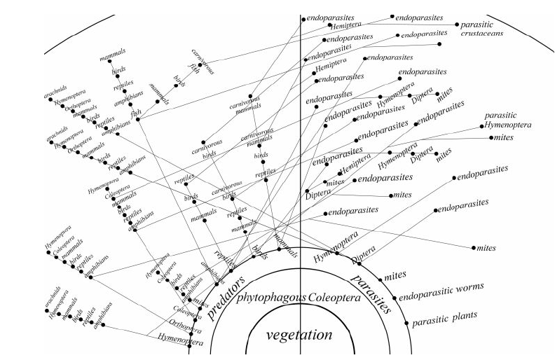
<bf> Elton (1927) </bf>

---

## Tipos de estudio


---

## Conceptos estadísticos
<center>

</center>

---

## Unidades de muestreo: ¿Para qué? 
<center>
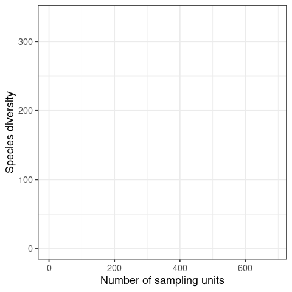
</center>


---

## Unidades de muestreo: ¿Para qué? 
<center>

</center>

---

## Tipos de variables
<center>

</center>

---

## Escalas de medición
<center>

</center>


---

## Empecemos...¿Qué rayos es R?
```{r, echo = F, eval = F}
library(DiagrammeR)

pdf("diagrama.pdf")

diagrama <- mermaid("graph LR
        A(<h2> Lenguaje de <br> Programación S <br> <br> -  1976 <h/2>)-->B(<h2> Lenguaje de <br> Programación R <br> <br> -  1993 </h2>)
        B-->C(<h2> Entorno de Desarrollo <br> Integrado: RStudio  <br> <br> -  2011 </h2>)
        ")

dev.off()

```

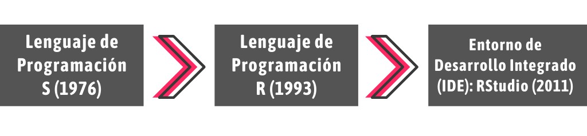
- R es considerado como un dialecto del lenguaje S 

- R fue creado por Ross Ihaka & Robert Gentleman

- Lenguaje de Programación Orientada a Objetos (POO)

- Si el objeto ya existe, su valor es borrado y reemplazado

- Operador asignación ( <- ) 

- Uso relativamente intuitivo

---

## Comunidad Comprometida

[](https://stackoverflow.com/) [](https://stats.stackexchange.com/)
[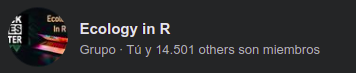](https://www.facebook.com/groups/ecologyinr)

---

## ¿Por qué debo usar R, y no SPSS, Infostat, Past, STATA...?

- Potencial en visualización de datos (gráficos de alto impacto)

- Potencial en uso estadístico  (Frecuentista & Bayesiano)

- R resume los resultados en una línea

- R es compatible con todo (código libre y abierto)

- Comunidad comprometida

- Conexión con otros software (\Latex, Python, Julia, QGIS, MaxEnt)

- R hace de todo

---

## Paquetes 
```{r}
# 20 de mayo a las 01:29 A.M.
nrow(available.packages())
```

```{r, echo = F, fig.width = 7, fig.height = 4.7, fig.align = 'center'}
library(png)
library(grid)
img  <- readPNG("images/crecimiento_paquetes.png")
grid.raster(img)
```

[Todos los Paquetes de R](https://www.rdocumentation.org/)

---

## El paquete que te soluciona la vida: **Tidyverse**
[Libro: R for Data Science (**Wickham** & Grolemund, 2017)](https://r4ds.had.co.nz/)

<p> </p>
<center>

</center>

---
class: center, middle, inverse
# Conociendo a RStudio: Workspace

---

# Atajos (Cheatsheet: [RStudio](https://drive.google.com/drive/u/0/folders/1T5eVp1UuQPDNDnNWRxe8WhtPDRF06aC9))

- Ctrl + Shift + N = Abrir Script

- Ctrl + S = Guardar Script

- Ctrl + W = Cerrar Script

- Ctrl + 1 = Ir a Script

- Ctrl + 2 = Ir a Consola

- Ctrl + L = Limpiar Consola

- Ctrl + 6 = Ir a Plots

- Ctrl + Tab = Mover entre Scripts

---

# Teoría y creación de objetos de R

R trabaja con objetos (POO), y **todos** tienen...
- **Nombre**: debe comenzar con una letra (A- Z o a-z), puede incluir letras, dígitos (0-9), y puntos (.). R discrimina entre mayúsculas y minúsculas (X y x).

```{r}
abundancia <- c(12, 12, 11, 10, 8, 23)
playas <- c("San Bartolo", "Pucusana", "Chancaíllo", "Santa Rosa", "Costa Azul", "Lurín")
```

--

- **Contenido**: Numérico o Caracteres

```{r}
abundancia
playas
```

---
- **Dimensión** (dataframe) o **longitud** (vector)

```{r}
length(abundancia)
length(playas)
```

```{r}
base_datos <- data.frame(
                        Alumnos = c("Yessica", "Juan", "Uriel"),
                        Nota = c(20, 17, 11)
                        )
base_datos
dim(base_datos)
```


---

# Estructura de datos (**clases**) en R
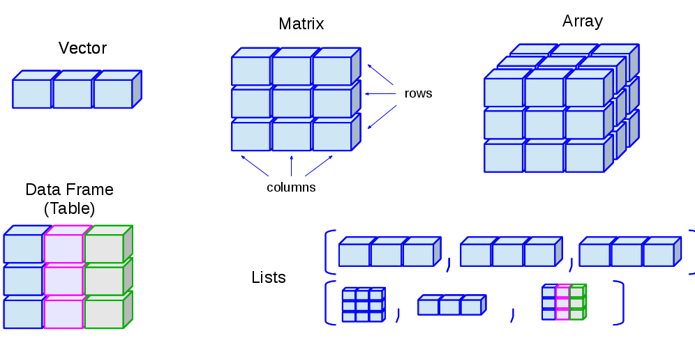
---

## Vector

```{r, echo = T}
Playas <- c("San Bartolo", "Pucusana", "Chancaíllo", "Santa Rosa", "Costa Azul", "Lurín")
class(Playas)
```

--

```{r, echo = T}
Nivel_contaminacion <- c("Saludable", "No Saludable", "Poco Saludable", "Saludable", "No Saludable", "No Saludable")
class(Nivel_contaminacion)
```

--

```{r, echo = T}
Presencia_garza <- c(T, F, T, T, F, T)
class(Presencia_garza)
```

--

```{r, echo = T}
Abundancia_garza <- c(12, 23, 10, 5, 10, 12)
class(Abundancia_garza)
```

---

## Data frame
```{r}
data <- data.frame(Playas, Nivel_contaminacion, Presencia_garza, Abundancia_garza)

data

dim(data)

class(data)

```

---

## Listas
```{r}
lista_a <- list(Playas, Nivel_contaminacion, data)
```

--

```{r}
lista_a[[1]]
```

--

```{r}
lista_a[[2]]
```

--

```{r}
lista_a[[3]]
```

---
## Listas

```{r}
lista_b <- list("Hola", Playas, "Colores") 
lista_b
```

---
## Indexación: Selección de subconjuntos 
### "Ingresar al objeto"

- Vector: [i]
```{r, echo = T, eval = F}
vector[4]
```

--

- Matrices y dataframes: [i, j]
```{r, echo = T, eval = F}
dataframe[4, 1]
```

--

- Arrays: [i, j, k]
```{r, echo = T, eval = F}
arreglo[1, 4, 9]
```

--

- Listas: [[i]]
```{r, echo = T, eval = F}
lista[[1]]
```


---
## Indexación con Data frame
```{r}
data[1, 2]

data[3, 1]

data[3, c(1,2,3,4)]

data[3, 1:4]

```

---
### Data frame: Indexación con DataEditR
```{r}
library(DataEditR)
# DataEditR::data_edit(data)
```


---

## Resumen
<center>
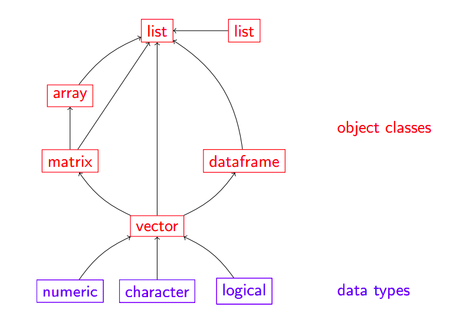
</center>

---
## Conversión y manipulación de objetos 
```{r, eval = F}
numerico <- c(1, 2, 3, 5, 67, 12, 231, 23)
numerico_2 <- c(1, 0, 1, 0, 1, 1, 1, 1)
```

--

- Convertir en caracter
```{r, eval = F}
caracter_convertido <-  as.character(numerico)
```

--

- Convertir en numérico
```{r, eval = F}
numerico_convertido <- as.numeric(caracter)
```

--

- Convertir en lógico
```{r, eval = F}
logico_convertido <- as.logical(numerico_2)
```

--

- Convertir en dataframe
```{r, eval = F}
df_convertido <- as.data.frame(numerico_2)
```

---
# Operadores lógicos 👀

```{r, echo = F}
library(kableExtra)
operadores_logicos <- data.frame(Símbolo = c("==", "!=", "<", "<=", ">", ">=", "|", "&", "!", "%in%"), Definición = c("igual", "no igual (diferente)", "menor que", "menor o igual que", "mayor que", "mayor o igual que", "o", "y", "no", "incluido en"))

kbl(operadores_logicos) %>% kable_styling(bootstrap_options = "striped", full_width = F, position = "center")

```

---

# Bases de datos
## Untidy data
<center>
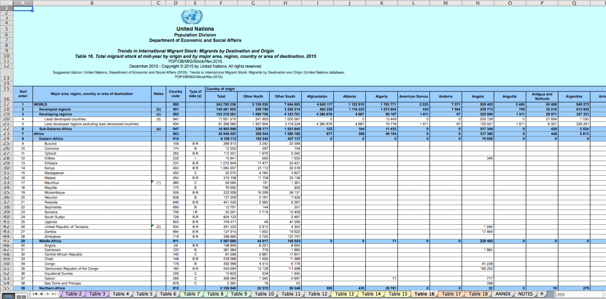

</center>


---

## Tidy data [(Wickham, 2014)](https://vita.had.co.nz/papers/tidy-data.pdf)

 - Estructura adecuada de la base de datos
 
 - Variable -> columna
 
 - Observación -> fila
 
 - Decimales deben ser puntos (se sugiere)


---
```{r, echo = F}
library(tidyverse)
library(kableExtra)
```

## ¿Será tidy?
```{r}
df1 <- data.frame(
                 nombres = c("Hormiga A", "Hormiga B", "Hormiga C", "Hormiga D"),
                 Pantanos_Villa = c(12, 22, 9, 10), 
                 Ventanilla = c(0, 7, 6, 1)
                 )
```

```{r, echo = F}
kable(df1) %>% kable_paper("striped") %>% kableExtra::kable_styling(font_size = 13)
```


---
## ¿Será tidy?
```{r}
df2 <- data.frame(
                  localidad = c("Pantanos de Villa, Ventanilla", "Pantanos de Villa, Ventanilla" ),
                  Hormiga_A = c(12, 0), 
                  Hormiga_B = c(22, 7), 
                  Hormiga_C = c(9, 6), 
                  Hormiga_D = c(10, 1)
                 )
```


```{r, echo = F}
kable(df2) %>% kable_paper("striped") %>% kable_styling(font_size = 13)
```

---
## ¿Será tidy? 
```{r, echo = F}
library(kableExtra)
```

```{r}
df3 <-  data.frame(
                  especie = c("Hormiga A", "Hormiga B", "Hormiga C", "Hormiga D", "Hormiga A", "Hormiga B", "Hormiga C", "Hormiga D"), 
                  localidad = c("Pantanos de Villa", 'Pantanos de Villa', "Pantanos de Villa", "Pantanos de Villa", "Ventanilla", 'Ventanilla', "Ventanilla", "Ventanilla"), 
                  abundancia = c(12, 22, 9, 10, 0, 7, 6, 1)
                  )
```

```{r, echo  = F}
kable(df3) %>% kable_paper("striped") %>% kable_styling(font_size = 13)
```

---
## ¿Y si no tengo ninguna data 😥?

```{r, echo = T, eval = F}
data("iris")
data("msleep")
data("trees")
data("beavers")
data("PlantGrowth")
data("InsectSprays")

library(iNEXT)
library(vegan)
data("ant")
data("spider")

# R presente en Ciencia ciudadana: 
library(rgbif)
library(rinat)
```

---

class: inverse, middle, center
# Importar bases de datos

---

### Importar en formato **CSV** (comma-separated values)
```{r, echo = T}
df <- read.csv("/home/biologisturiel/Descargas/talleres_en_R/github_talleres/data/data_emerita.csv",
               header = T,
               sep = ",",
               dec = ".")
```

--

```{r}
head(df, 4)
```

---

### Importar en formato Excel (xls, xlsx)
```{r, eval = F}
library(readxl)
df_excel <- read_excel('aca debe ir la dirección en donde se encuentra tu archivo, tu archivo debe acabar en xls o xlsx', sheet = "Hoja1")
```

--

### Importar un Excel Drive (Google)
```{r, eval = F}
library(gsheet)
df_excel_drive <- gsheet2tbl("https://docs.google.com/spreadsheets/d/13gV_HUqe55328loEn0XPaxxG7-pNbpZ9/edit#gid=1922099029")
```

--

### Importar archivos de más de 3GB (muy pesados)
```{r, eval = F}
library(data.table)
df_pesada <- fread("/home/biologisturiel/Descargas/talleres_en_R/github_talleres/data/data_emerita.csv")
```

---

### Importar del portapapeles (clipboard)
```{r, eval = F}
df_clipboard <- read.delim("clipboard")
```

--

### Importar archivos delimitados por espacios (txt) (por ejem [GBIF](https://www.gbif.org/))
```{r, eval = F}
library(data.table)
df_gbif <- fread("/home/biologisturiel/Descargas/talleres_en_R/github_talleres/data/occurrence.txt")
```

--

### Importar con file.choose 
```{r, eval = F}
df_aelegir <- fread(file.choose()) 
```

--

### Importar con clicks 
```{r}
# Desde RStudio
```

---

class: inverse, middle, center
# Exportar bases de datos (y resultados)

---

### Exportar en formato CSV (decimal: punto)
```{r, eval = F}
data("iris")
write.csv(iris, "df_iris_punto.csv", row.names = F)
```

--

### Exportar en formato CSV (decimal: coma)
```{r, eval = F}
data("iris")
write.csv(iris, "df_iris_coma.csv", row.names = F)
```

--

### Exportar en formato Excel (xls, xslx)
```{r, eval = F}
data("msleep")
write.xlsx(msleep, "df_msleep.xlsx")
```

---
## Comandos fundamentales para reconocer un objeto 
```{r, eval = F}
# muestra todos los objetos del environment 
ls()
# muestra los objetos acorde al patrón solicitado
ls(pat = "^m")
# estructura del objeto
str()
# remueve objeto 
rm()
# remueve todos los objetos
rm(list = ls())
# remueve objetos acorde al patrón
rm(list = ls(pat = "^m"))
# clase de objeto
class()
# filas del objeto
nrow()
# columnas del objeto
ncol()
```

---

## Comandos fundamentales para reconocer un objeto 
```{r, eval = F}
# longitud 
length()
# dimensión
dim()
# ver niveles del factor
level()
# nombres de columnas del objeto 
names()
# abrir (ver) el objeto
View()
# ver parte inicial del objeto 
head()
# ver parte final del objeto
tail()
# resumen del objeto
summary()
# frecuencias absolutas del objeto
table()
# frecuencias relativas del objeto
prop.table()

```

---

class: inverse, middle, center
#Ahora es tú turno

```{r, echo = F}
# remotes::install_github("gadenbuie/countdown")
countdown::countdown(minutes = 5, seconds = 00)
```

---
## Deja tu código abajo:

.can-edit[
<ul>
<li>Sí, acá...</li>
<li> </li>
<li> </li>
<li> </li>
<li> </li>
<li> </li>
<li> </li>
<li> </li>
<li> </li>
<li> </li>
<li> </li>
<li> </li>
<li> </li>
<li> </li>
<li> </li>
<li> </li>
<li> </li>
</ul>
]

---

# Distribución y teoría de la probabilidad
- Los datos de ecología casi nunca se adecúan a una distribución normal

- Los datos de ecología se pueden transformar pero la conclusión sería en función de los datos transformados

- Datos en ecología: Usan distribución de **Poisson** (recuentos) o **Binomial** (presencia o ausencia) sobretodo para GLM

---

## Distribución normal

.panelset[
.panel[.panel-name[Plot]
<center>
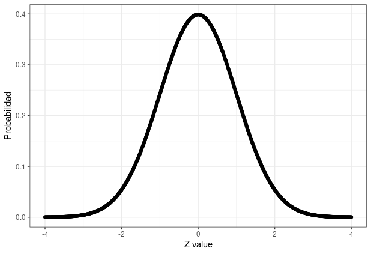
</center>
]

.panel[.panel-name[Código]
```r
library(ggthemes)

Z_value <- seq(-4, 4, length = 1000)
Probabilidad <- dnorm(Z_value)
data_normal <- data.frame(x = Z_value, y = Probabilidad)

ggplot(data = data_normal,
       aes(x = x,
           y = y)) +  
        geom_jitter() + 
        xlab("Z value") +
        ylab("Probabilidad") + 
        theme_bw()
        
```
]]


---

## Distribución de Poisson (recuentos)

.panelset[
.panel[.panel-name[Plot]
<center>
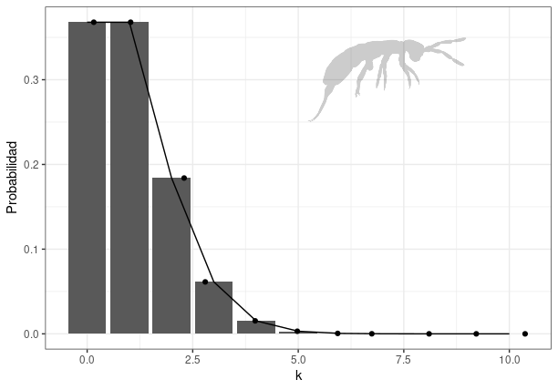
</center>

]

.panel[.panel-name[Código]
```r
library(rphylopic)
library(ggthemes)
bug <- image_data("136edfe2-2731-4acd-9a05-907262dd1311", size="512")[[1]]

ggplot(transform(data.frame(x = c(0:10)), y = dpois(x, 1)), aes(x, y)) + 
  geom_bar(stat = "identity") + 
  geom_line() +
  geom_jitter() +
  theme_bw() +
  ylab("Probabilidad") + 
  xlab("k") + 
  add_phylopic(bug, alpha = 0.2, ysize = 2, x = 7.1, y = 0.3)

```
]]

---

## Distribución Binomial (presencia o ausencia)


.panelset[
.panel[.panel-name[Plot]
<center>
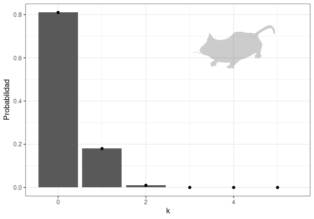
</center>
]

.panel[.panel-name[Código]
```r
mouse <- image_data("6b2b98f6-f879-445f-9ac2-2c2563157025", size="512")[[1]] 

ggplot(transform(data.frame(x = c(0:5)), y = dbinom(x, 2, prob = 0.1)), aes(x, y)) +
  geom_bar(stat = "identity") +
  geom_point() +  
  theme_bw() + 
  add_phylopic(mouse, alpha = 0.2, ysize = 800, x = 1, y = 2500, ) + 
  xlab("k") + 
  ylab(expression(paste("Probabilidad"))) +
  add_phylopic(mouse, alpha = 0.2, ysize = 1, x = 4, y = 0.65) 
```
]
]


---

## Distribución de una especie (SDM: Species Distribution Model)
```{r, echo = F, eval = F}
library(RColorBrewer)

cols <- brewer.pal(3, "BuGn")
pal <- colorRampPalette(cols)

image(volcano, col = pal(20))
```

<center>
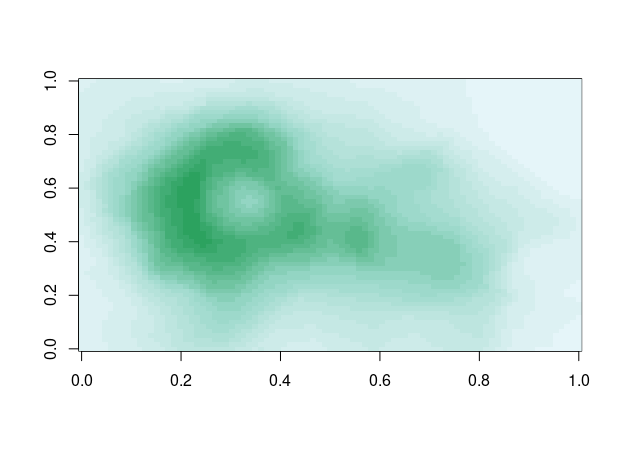
</center>

---
## Distribución de una especie (SDM: Species Distribution Model)
```{r, echo = F, eval = F}
set.seed(1)
x <- rnorm(10000)
y <- rnorm(10000)
p_sdm2 <- smoothScatter(x, y)

```

<center>
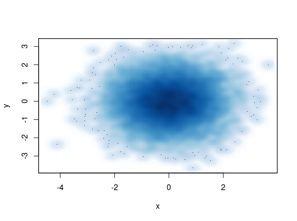
</center>


---

class: center, inverse, middle
# Estadísticos descriptivos 

---

## Estadísticos de tendencia central

--

### Media (promedio)
$$
\overline x=\frac{\sum x}{n}
$$
--

```{r}
mean(df$LCT)
```

### Mediana

$$
Mediana  = \frac{(n + 1)}{2}
$$
```{r}
median(df$LCT)
```

---

### Moda

- El valor de mayor frecuencia absoluta 

```{r, echo = T}
frecuencias <- table(df$LCT)
frecuencias_df <- as.data.frame(frecuencias)
which.max(frecuencias_df$Freq)

frecuencias_df[56, ]
```

---

## Estadísticos de dispersión

--

### Varianza 
$$
s^{2} = \sqrt \frac{\sum(x_{i} - \overline x)^{2}}{n}
$$
```{r}
var(df$LCT)
```

### **Desviación estándar (DE o SD) **
$$
s = \sqrt \frac{\sum(x_{i} - \overline x)^{2}}{n}
$$
```{r}
sd(df$LCT)
```

---

### Coeficiente de variación (adimensional)
$$
CV = \frac{s}{\overline x}*100
$$
```{r}
sd(df$LCT)/mean(df$LCT)*100
```

--

### **Error estándar (EE or SE) **
$$
SE = \frac{s}{\sqrt{n}}
$$
```{r}
sd(df$LCT)/sqrt(nrow(df))
```
### [**¿SD o SE?**](https://www.ncbi.nlm.nih.gov/pmc/articles/PMC1255808/#:~:text=The%20standard%20deviation%20(often%20SD%20is%20a%20measure%20of%20variability.&text=We%20can%20estimate%20how%20much,standard%20deviation%2C%20confusion%20is%20understandable)

---

## Obtención de estadísticos 
### [Data de aplicación](https://www.researchgate.net/publication/330900496_IMPLICATIONS_OF_THE_SANITARY_QUALITY_OF_BEACHES_IN_THE_PARASITIC_ECOLOGY_OF_EMERITA_ANALOGA_STIMPSON_1857_DECAPODA_HIPPIDAE)

```{r}
library(tidyverse)
glimpse(df)
```

---
### Conociendo los **niveles** de las variables independientes (factor)
```{r}
unique(df$LC)
```
--

```{r}
unique(df$NMP)
```

--
```{r}
unique(df$EST)
```

--
```{r}
unique(df$SEX)
```

---
### Valores máximos y mínimos 
```{r}
min(df$NTP)
which.max(df$NTP)
```
--

```{r}
max(df$NTP)
which.min(df$NTP)
```

--
```{r}
range(df$NTP)
c(min(df$NTP), max(df$NTP))
```

---

### Estadísticos según variable independiente (factor)
```{r}
aggregate(NTP ~ NMP, df, mean)
```

--

```{r}
aggregate(NTP ~ NMP, df, sd)
```

---

### Estadísticos según variable independiente (factor)
```{r}
library(Rmisc)
RP_lc_sex <- summarySE(df, measurevar = c("RP"), groupvars = c("LC", "SEX"))
RP_lc_sex
```

---

### Estadísticos según variable independiente (factor)
```{r}
library(Rmisc)
NTP_lc_sex <- summarySE(df, measurevar = c("NTP"), groupvars = c("LC", "SEX"))
```

---

### Redondear 
```{r}
round(NTP_lc_sex$NTP, 3)
```

--

```{r}
NTP_lc_sex[, -c(1,2)] <- round(NTP_lc_sex[, -c(1,2)], 2)
head(NTP_lc_sex, 7)
```

---

## Subsetting (filtrar, seleccionar) 
```{r, eval = F}
subset(NTP_lc_sex, select = c(LC, SEX, N, NTP, sd))
```

--

```{r}
subset(NTP_lc_sex, NTP > 3)
```

---

## Subsetting (filtrar, seleccionar) 
```{r}
subset(NTP_lc_sex, NTP == 4)
```
--

```{r}
subset(NTP_lc_sex, NTP != 4)
```

---

## Subsetting (filtrar, seleccionar) 
```{r}
subset(NTP_lc_sex, NTP %in% 5.50)
```

--

```{r}
subset(NTP_lc_sex, NTP %in% c(4, 5.50))
```

---
class: center, inverse, middle
# Dudas 🤔

---

# Pero antes...🤔
- example(): Un ejemplo de R sobre cualquier comando

- [**Swirl**](https://swirlstats.com/students.html): Paquete para aprender R <3

- help(): Pedir ayuda en R (muestra info relacionada al comando)

- Stackoverflow: Comunidad comprometida

- Cheatsheet: [Basic](https://www.rstudio.com/wp-content/uploads/2016/10/r-cheat-sheet-3.pdf); [Dplyr](https://www.rstudio.com/wp-content/uploads/2015/02/data-wrangling-cheatsheet.pdf); [ggplot2](https://www.rstudio.com/wp-content/uploads/2015/03/ggplot2-cheatsheet.pdf)

---

class: center, inverse, middle
# Fin 👨‍💻


